# unity3xGameDevelopmentEssentials
本项目是书籍[《Unity 3.x游戏开发经典教程》](http://book.douban.com/subject/22925700/)（英文版[《Unity 3.x Game Development Essentials》](http://www.amazon.com/Unity-3-x-Game-Development-Essentials/dp/1849691444/ref=sr_1_1?ie=UTF8&qid=1450686270&sr=8-1&keywords=Unity+3.x+Game+Development+Essentials)）的例子。
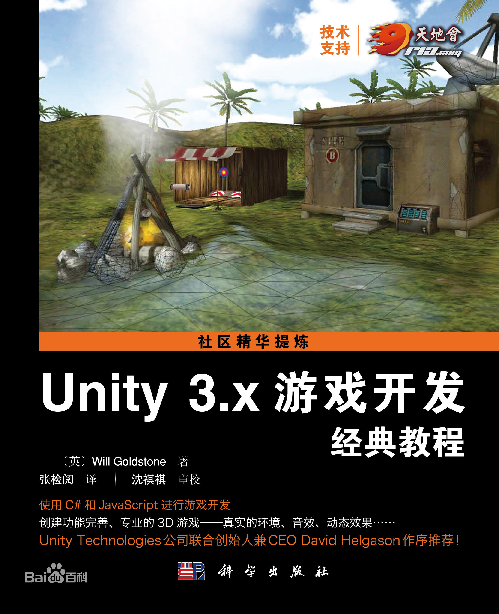

其中按照chapter做区分了，每个chapter作为单独的Unity项目，可使用Unity单独打开每个chapter；因为使用的[Unity](http://unity3d.com/cn/get-unity/download/archive)版本是[5.3.0](http://unity3d.com/cn/unity/whats-new/unity-5.3)，所以对于3.x版本中已经过期的API使用了5.3.0的新API做替换了（其实Unity编辑器会自动检测C#脚本，如果发现使用过时API的话，会提示是否尝试自动修复，**但不敢确保修复的正确性，最好先备份！**）

## chapter02
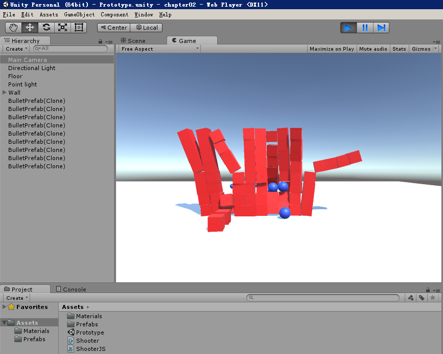

## chapter03
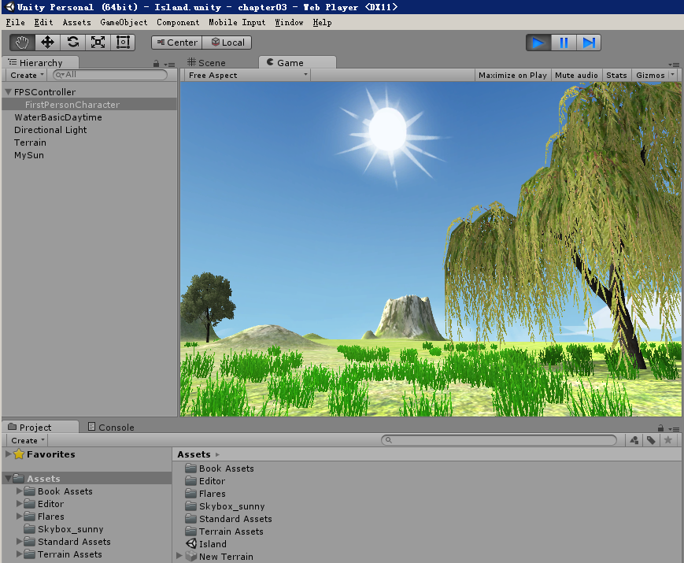

## chapter05
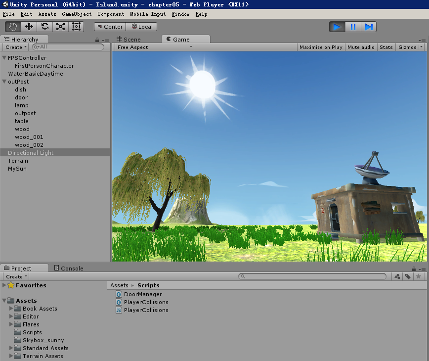

## chapter06
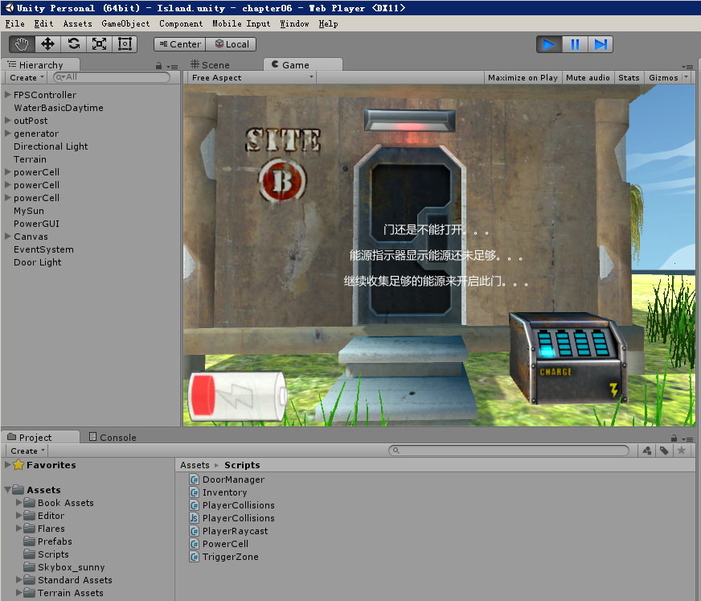

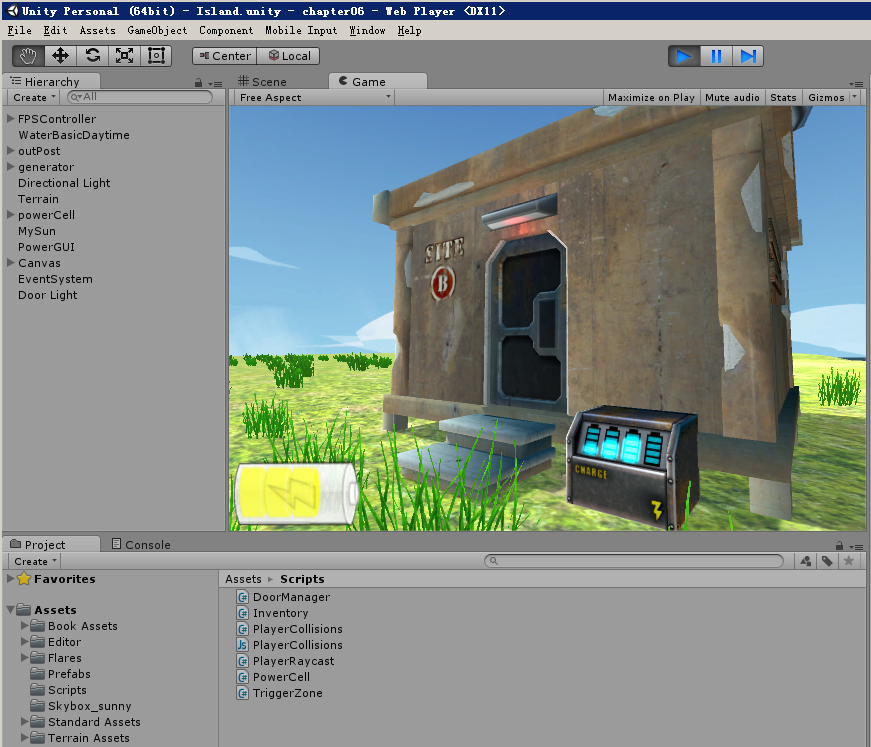

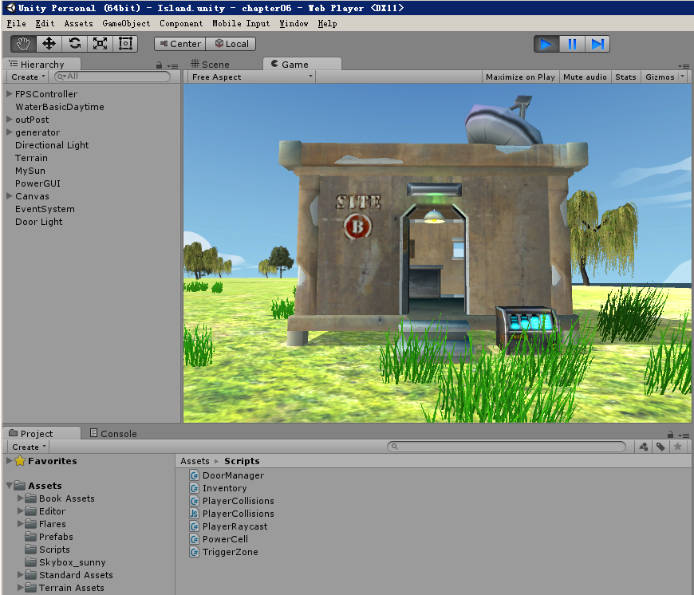

### 遇到的问题
#### GUITexture在第一人称视角下不能正常显示

**问题：**发现添加的GUITexture根本不能显示，即在第一人称视角摄像机中不能显示

**解决：**起初也没找到原因，以为是不是Unit5版本想替换掉GUITexture？然后各种尝试，在编辑器下面创建了画板（Canvas），并添加原画组件（RawImage）就可以显示了，于是乎把UI组件都使用Canvas+RawImage的方式重新组织了一下，并写了个UIManager控制显示/隐藏；但是在chapter09的时候却发现是可以显示GUITexture的，唯一不同的地方是摄像机，一个是FPSController子组件的，一个是我们自己创建的，比较了一下发现原来是确少GUILayer组件导致不能显示GUITexture！而且需要注意的是GUITexture的位置的x和y值范围在0到1之间！

## chapter07
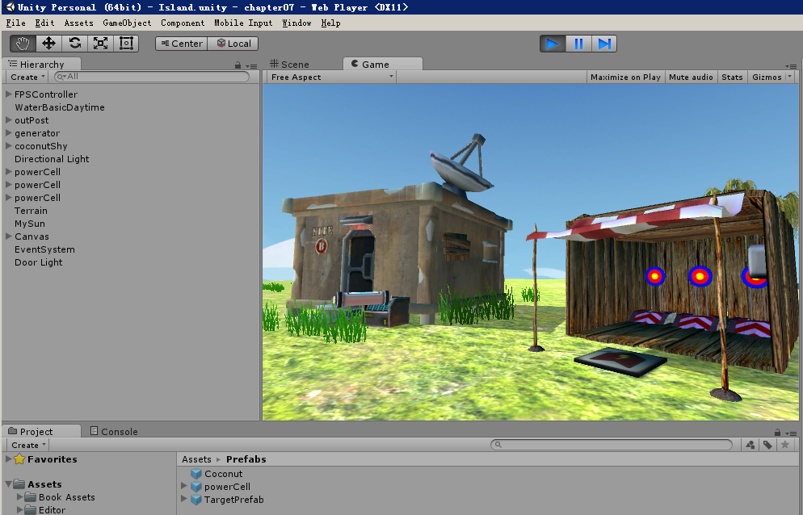

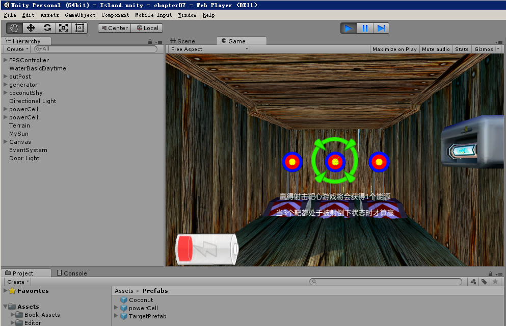

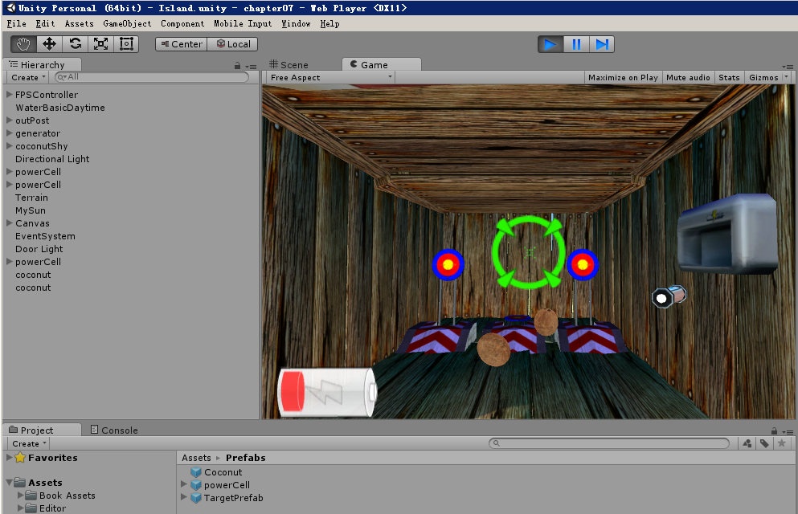

## chapter08
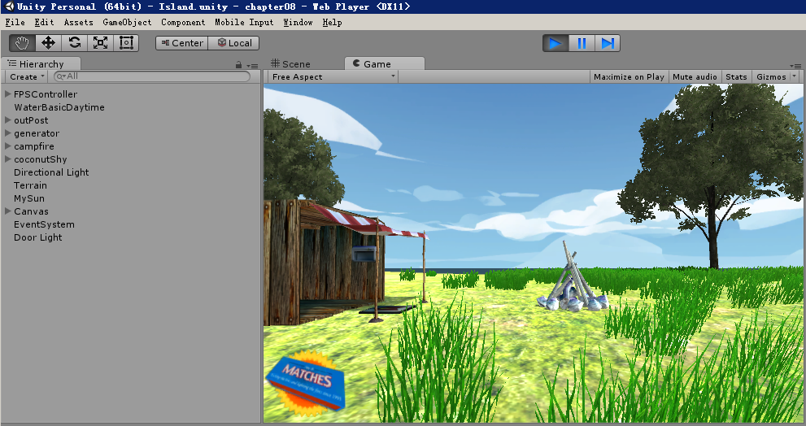

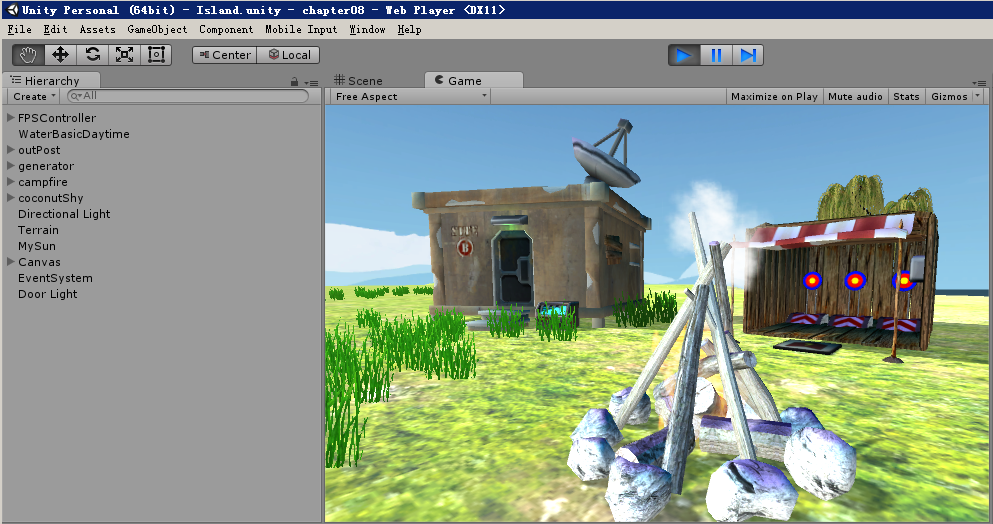

## chapter09
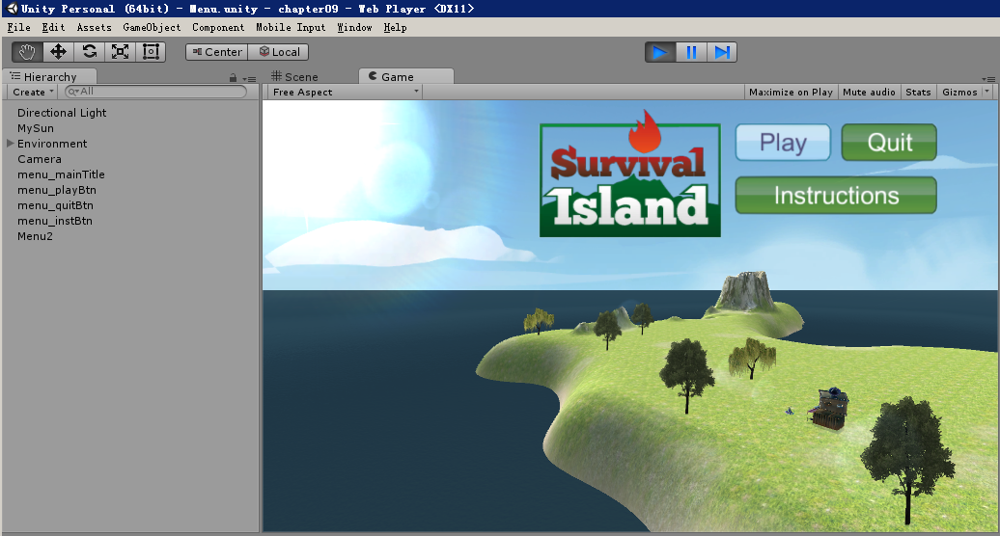

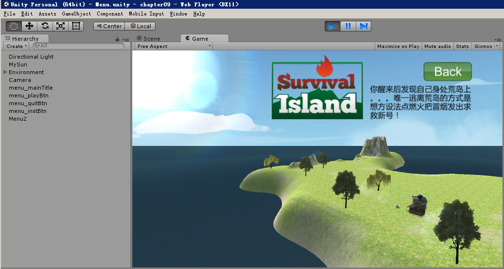

### 遇到的问题
#### 切换场景后天空盒反射光无效导致画面黑暗
**问题：**因为本章涉及到切换场景功能，所以发现从Menu主菜单场景切换到游戏IsLand场景，明显画面变黑，材质变黑了，搜索了一番，发现应是**Unity5版本有天空盒光效自动渲染的过程**，所以你会发现之前有天空盒的chapter中，刚进入Unity加载时画面最初也是偏黑的，过一会天空盒反射光效完毕后才慢慢明亮起来

**解决：**暂时尚未解决。。。有猜想过是不是可以使用脚本写代码控制天空盒的反射光效，等到天空盒反射光效渲染完毕后才切换至IsLand场景，但控制天空盒反射光效的代码需要深入了解Unity5的支持了，或者有没有其他办法解决这个问题呢？

[unity3d贴吧里也有询问的](http://tieba.baidu.com/p/4046051118)，貌似说是build打包出来的不会有此问题，那这倒好了，最后build打包后在验证一下

## chapter10
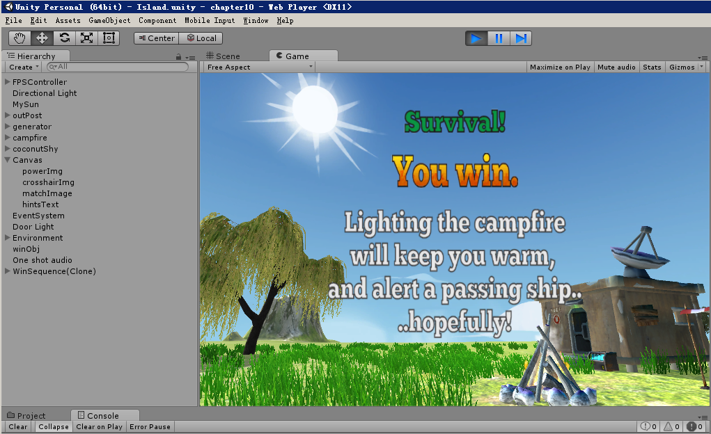

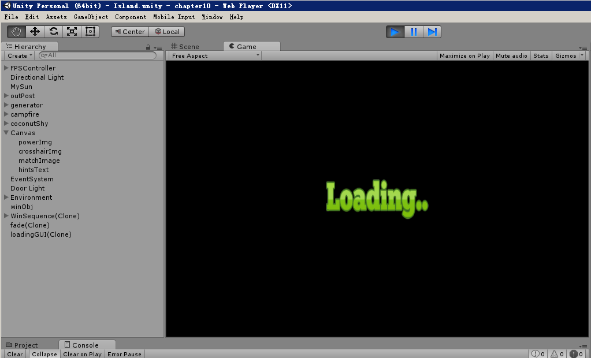
